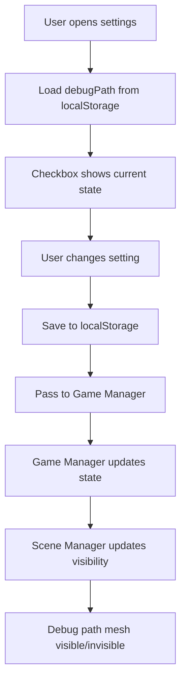

# Debug Main Path Feature Design

## Overview
Add "Show Debug Path" setting that displays semi-transparent trail showing main path from start to finish. Setting persists across page refreshes.

## Requirements
- Semi-transparent highlighted trail on maze floor
- Only visible during gameplay (not menus)
- Toggleable via settings UI
- Persists across F5 refreshes
- Available in production to all players
- Shows main path from start to finish

## Architecture

### Storage
- `localStorage` key: `marble-maze-debug-path` (boolean)
- Default value: `false` (disabled)
- Loaded on game startup
- Saved when settings changed

### Components

#### 1. Settings UI (`hudManager.ts`)
- Add checkbox to existing settings modal:
  ```html
  <div class="modal-group">
    <label for="setting-debug-path">Show Debug Path</label>
    <input type="checkbox" id="setting-debug-path" class="modal-checkbox" />
  </div>
  ```
- Load saved value on modal open
- Save to localStorage on save
- Pass to game manager via callbacks

#### 2. Game Manager (`main.ts`)
- Add property: `private debugPathEnabled: boolean = false;`
- Add methods:
  ```typescript
  private loadDebugPathSetting(): boolean {
    return localStorage.getItem('marble-maze-debug-path') === 'true';
  }
  
  private saveDebugPathSetting(enabled: boolean) {
    localStorage.setItem('marble-maze-debug-path', enabled.toString());
  }
  ```
- Update `updateSettings` to handle debug path
- Pass setting to scene manager

#### 3. Scene Manager (`sceneManager.ts`)
- Add debug path mesh creation:
  ```typescript
  private debugPathMesh: THREE.Mesh | null = null;
  
  private createDebugPath(mazeData: MazeData) {
    // Create semi-transparent plane mesh
    // Position along main path cells
    // Add to scene
  }
  
  private updateDebugPathVisibility(visible: boolean) {
    if (this.debugPathMesh) {
      this.debugPathMesh.visible = visible;
    }
  }
  ```
- Call from `buildMazeMesh` when setting enabled

#### 4. Maze Data Integration
- Use existing `mazeData.mainPath` array
- Convert grid coordinates to world positions
- Create decal meshes centered on path cells

## Visual Design

### Appearance
- Semi-transparent blue-green color (`rgba(100, 200, 255, 0.5)`)
- Slightly raised above floor (y = 0.01) to avoid z-fighting
- Width: 80% of cell size
- Length: follows each main path cell
- Smooth transitions between cells

### Materials
- `THREE.MeshBasicMaterial` with:
  - `transparent: true`
  - `opacity: 0.5`
  - `side: THREE.DoubleSide`
  - `color: 0x64C8FF`

### Geometry
- `THREE.PlaneGeometry` for each path segment
- Combined into single merged geometry for performance
- Positioned at cell centers along main path

## Data Flow



## Implementation Steps

1. **Add localStorage handling**
   - Add load/save methods in `main.ts`
   - Integrate with existing settings system

2. **Add UI elements**
   - Add checkbox to settings modal HTML
   - Add event handlers in `hudManager.ts`
   - Update callbacks interface

3. **Create debug path rendering**
   - Add mesh creation in `sceneManager.ts`
   - Position using main path coordinates
   - Handle visibility toggling

4. **Integrate with game flow**
   - Load setting on game startup
   - Update when settings change
   - Recreate path on maze regeneration

5. **Test persistence**
   - Verify setting persists across F5
   - Test enabling/disabling during gameplay
   - Check visibility in different mazes

## Error Handling

- If localStorage unavailable, default to disabled
- If main path empty, don't create mesh
- If maze regenerates, recreate debug path
- Handle missing DOM elements gracefully

## Testing Strategy

### Manual Tests
1. Enable setting, refresh page → path still visible
2. Disable setting → path disappears
3. Change mazes → path updates correctly
4. Different difficulties → path scales appropriately

### Visual Checks
1. Path follows main route correctly
2. Semi-transparent and not distracting
3. Visible on all terrain types
4. Doesn't interfere with gameplay

## Success Criteria

- ✅ Setting persists across page refreshes
- ✅ Debug path visible when enabled
- ✅ Path shows correct main route
- ✅ No performance impact
- ✅ Works with all maze sizes/difficulties
- ✅ Available in production to all players

## Open Questions

None - design approved and ready for implementation.